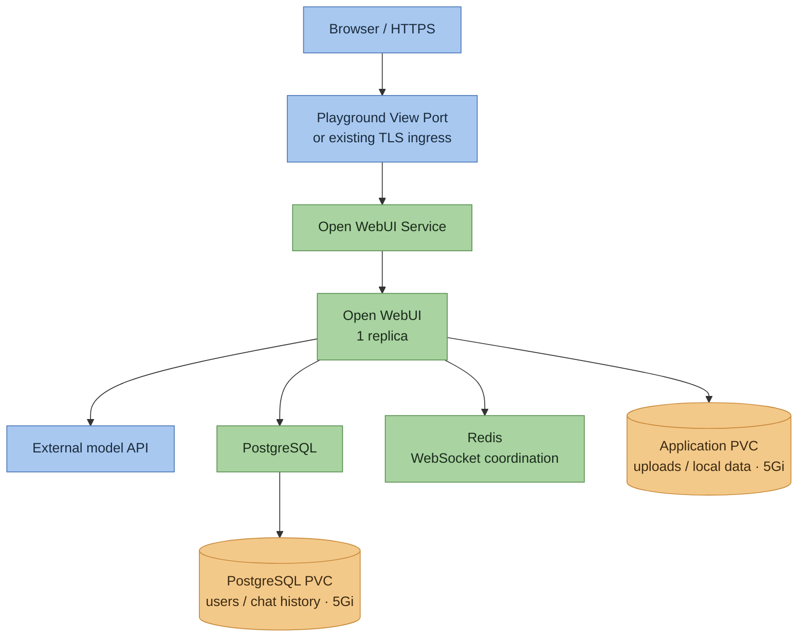

# Open WebUI — Kubernetes Deployment

> A Kubernetes DevOps layer (Helm, PostgreSQL, Redis, GitHub Actions CI validation) built on top of Open WebUI, a self-hosted LLM chat interface.


---

## Table of Contents

- [Project Description](#project-description)
- [Video Series](#video-series)
- [Attribution](#attribution)
- [V1 — Kubernetes Deployment](#v1--kubernetes-deployment)
- [Architecture](#architecture)
- [Tech Stack](#tech-stack)
- [Prerequisites](#prerequisites)
- [How to Deploy](#how-to-deploy)
- [Browser Access](#browser-access)
- [Project Structure](#project-structure)
- [Verification](#verification)
- [Backup and Recovery](#backup-and-recovery)
- [Command Reference](#command-reference)
- [Limitations](#limitations)

---

## Project Description

This repo takes [Open WebUI](https://github.com/open-webui/open-webui) — a full-featured, self-hosted web interface for LLMs (Python/FastAPI backend, Svelte frontend, supports Ollama and any OpenAI-compatible API) — and adds a Kubernetes deployment layer around it, without touching a single line of application code.

The project runs on an existing **Kubernetes multi-node** playground. A pinned official Helm chart deploys Open WebUI; PostgreSQL stores users and chat history, Redis supports WebSocket communication, and persistent volumes hold database files and uploads.

Everything under `helm-chart/`, `scripts/`, `docs/`, and `.github/workflows/deploy.yml` is new, purpose-built deployment tooling. Application source is untouched.

## Video Series

| Part | Tag | Focus | Status |
|---|---|---|---|
| V1 | `v1.0-openwebui-k8s-deployment` | Kubernetes deployment, model connection, chat and persistence verification | Fully verified live; tag created and pushed |

## Attribution

Open WebUI application source and branding belong to [**open-webui/open-webui**](https://github.com/open-webui/open-webui). See [LICENSE](LICENSE), [LICENSE_NOTICE](LICENSE_NOTICE), and [LICENSE_HISTORY](LICENSE_HISTORY).

The application deployment uses the [official Open WebUI Helm chart](https://github.com/open-webui/helm-charts). ThinkWithOps adds the deployment and operations layer described here.

---

## V1 — Kubernetes Deployment

V1 includes:

- One Open WebUI replica using the published upstream image.
- PostgreSQL with persistent storage for application records.
- Authenticated Redis for WebSocket coordination and transient state.
- A separate persistent volume for uploads and application files.
- An external OpenAI-compatible model endpoint, configured through Kubernetes Secrets.
- Browser access through Playground View Port or an existing TLS ingress.
- Preflight, deployment, chat verification, evidence export, and encrypted backup/restore scripts.
- GitHub Actions for Helm linting, rendering, and configuration checks.

**Current status:** fully verified live in the playground — deployment, Groq-backed chat, browser access, streaming/WebSocket behavior, uploads, restart persistence, encrypted backup, and fresh-session restore confirmed during the live run.

## Architecture



### How this flows

**Deployment:** GitHub Actions validates the configuration. Deployment runs manually from the playground terminal using Helm.

**Chat:** browser requests reach Open WebUI through its Service. Open WebUI authenticates the user and calls the configured model endpoint.

**State:** PostgreSQL stores application records; the application PVC stores uploaded files and local data. Redis coordinates WebSocket state. One replica and the `Recreate` deployment strategy avoid simultaneous application writers on the RWO volume.

## Tech Stack

| Technology | Version | Role |
|---|---|---|
| Open WebUI | v0.11.3 | Chat interface; published upstream image |
| Official Open WebUI chart | 16.5.0 | Application Deployment, Service, and PVC |
| Project wrapper chart | 1.0.0 | Playground configuration, PostgreSQL, and Redis |
| PostgreSQL | 17.11-bookworm | Persistent application database |
| Redis | 7.4.11-alpine3.21 | Authenticated WebSocket state |
| Helm | 3.19.0 in CI | Dependency management and deployment |
| Bash / Python | Python 3.10+, PyYAML 6.0.2 | Deployment and verification scripts |
| GitHub Actions | Validation workflow | Lint, render, configuration guards |

## Prerequisites

> V1 was built and verified against a **time-limited Kubernetes lab environment**, so examples below use its terminology (View Port, session expiry). The scripts and Helm chart target any Kubernetes cluster — pick the path below matching where you're running this.

Common to every path:
- Helm, Bash, Git, curl, Python 3.10+, and Python venv support.
- Two 5Gi volumes and at least **850m CPU / 1344Mi memory** available for workload requests, plus Kubernetes system capacity.
- An approved OpenAI-compatible HTTPS endpoint, API key, and chat model ID.
- `kubectl` pointed at the target cluster (`kubectl config current-context`).

**Local (minikube / kind / Docker Desktop Kubernetes):**
- Cluster running with a default StorageClass already present (minikube/kind ship one — confirm with `kubectl get storageclass`).
- Browser access via `kubectl port-forward` or `minikube service` — no View Port/ingress needed.
- No session expiry; skip `SESSION_EXPIRES_AT`.

**Cloud (EKS / GKE / AKS, your own account):**
- Cluster provisioned and `kubectl` context pointed at it; a cloud StorageClass exists by default (e.g. `gp2`/`gp3` on EKS).
- Browser access via a `LoadBalancer` Service or an ingress controller + your own domain/TLS — not View Port.
- No session expiry; skip `SESSION_EXPIRES_AT`. Real cloud cost applies — size resources accordingly.

**Time-limited lab playground (what V1 was verified against):**
- A working StorageClass or the [local-PV setup](docs/storage.md) if none exists.
- Access via the lab's View Port / NodePort exposure — see [Browser Access](#browser-access).
- The active session's expiry time and HTTPS browser access URL — note both before deploying.

## How to Deploy

All three paths share the same clone + venv setup, then diverge at the environment variables and browser access step. Use a checkout or transferred copy containing the V1 files; unpublished local changes are not available through `git clone`.

```bash
git clone https://github.com/ThinkWithOps/thinkwithops-openwebui-production.git
cd thinkwithops-openwebui-production

mkdir -p _local
python3 -m venv _local/venv
source _local/venv/bin/activate
python3 -m pip install -r scripts/requirements-validation.txt

kubectl config current-context
kubectl get storageclass
```

### Path A — Local (minikube / kind / Docker Desktop)

```bash
export EXPECTED_CONTEXT='REPLACE_WITH_YOUR_LOCAL_CONTEXT'
export PLAYGROUND_ACCESS_METHOD='kubectl port-forward on 8080'
export STORAGE_CLASS='standard'   # or whatever `kubectl get storageclass` shows as default
unset SESSION_EXPIRES_AT

bash scripts/preflight.sh
python3 scripts/configure-playground.py
export PREFLIGHT_REVIEWED=yes
bash scripts/deploy.sh
```

Browser access:

```bash
kubectl get svc -n <namespace>
kubectl port-forward -n <namespace> svc/<open-webui-service> 8080:80
# open http://localhost:8080
```

### Path B — Cloud (EKS / GKE / AKS, your own account)

```bash
export EXPECTED_CONTEXT='REPLACE_WITH_YOUR_CLOUD_CONTEXT'
export PLAYGROUND_ACCESS_METHOD='LoadBalancer Service'   # or 'Ingress' if you have a controller + domain
export STORAGE_CLASS='REPLACE_WITH_CLOUD_STORAGE_CLASS'  # e.g. gp3 on EKS, standard-rwo on GKE
unset SESSION_EXPIRES_AT

bash scripts/preflight.sh
python3 scripts/configure-playground.py
export PREFLIGHT_REVIEWED=yes
bash scripts/deploy.sh
```

Browser access:

```bash
kubectl get svc -n <namespace>
# LoadBalancer: use the EXTERNAL-IP/hostname shown
# Ingress: use your own domain + TLS, see docs/deployment.md#existing-ingress--tls
```

### Path C — Time-limited lab playground (what V1 was verified against)

```bash
# Replace with the inspected session details.
export EXPECTED_CONTEXT='REPLACE_WITH_PLAYGROUND_CONTEXT'
export SESSION_EXPIRES_AT='REPLACE_WITH_ACTUAL_EXPIRY_AND_TIMEZONE'
export PLAYGROUND_ACCESS_METHOD='Playground View Port on 30080'
export STORAGE_CLASS='REPLACE_WITH_VERIFIED_CLASS'

bash scripts/preflight.sh
```

Review preflight results and resolve blocked checks. If no StorageClass exists, complete [storage setup](docs/storage.md) first, then rerun preflight. Obtain the HTTPS View Port URL, then configure the application:

```bash
python3 scripts/configure-playground.py
export PREFLIGHT_REVIEWED=yes
bash scripts/deploy.sh
```

Browser access: **Playground View Port → 30080**. Set `WEBUI_URL` to the exact HTTPS URL generated by the active session. If View Port runs on a separate entry node, use the [forwarding instructions](docs/deployment.md).

---

All paths: the configuration script prompts for the endpoint, model, storage, browser URL, admin credentials, and API key. Credentials stay in Kubernetes Secrets and ignored private files. Keep `WEBUI_SECRET_KEY` stable across restarts and restores.

See the [deployment guide](docs/deployment.md) for Helm installation, credential handling, and ingress configuration.

## Browser Access

- **Local:** `kubectl port-forward`, then open `http://localhost:<port>`.
- **Cloud:** `LoadBalancer` Service EXTERNAL-IP, or your own ingress + domain + TLS — see the [TLS ingress profile](docs/deployment.md#existing-ingress--tls).
- **Lab playground:** View Port → 30080, HTTPS URL generated per session — see the [forwarding instructions](docs/deployment.md) if View Port runs on a separate entry node.

## Project Structure

```text
helm-chart/                     Pinned Helm wrapper and playground profiles
scripts/preflight.sh            Environment and permission checks
scripts/configure-playground.py Private credentials and session configuration
scripts/deploy.sh               Repeatable Helm deployment
scripts/verify.sh               Health, chat, and pod-restart persistence checks
scripts/export-artifacts.sh     Sanitized configuration and state export
scripts/backup.sh               Encrypted backup
scripts/restore.sh              Fresh-session restore
.github/workflows/deploy.yml    CI validation
docs/deployment.md              Detailed setup and browser access
docs/storage.md                 Storage setup
docs/verification.md            Browser and acceptance checklist
docs/recovery.md                Backup and recovery runbook
docs/evidence/v1/               Verification results
_local/                        Ignored credentials and session files
```

## Verification

```bash
bash scripts/verify.sh
bash scripts/export-artifacts.sh
```

The scripts check database/Redis connectivity, sign-in, a real model response, saved chat history, and persistence after restarting only Open WebUI. Complete the [browser checklist](docs/verification.md) for HTTPS, streaming, WebSockets, and uploaded files.

| Check | Status |
|---|---|
| Helm lint/render, both access profiles | Passed |
| Configuration guards, syntax, 8 guard tests | Passed |
| Playground deployment and backend readiness | Passed — live run |
| Real model chat | Passed — Groq `openai/gpt-oss-20b` |
| Browser HTTPS, streaming, WebSockets and upload | Passed — live run |
| App-only restart persistence | Passed |
| Encrypted backup and fresh-session restore | Passed — live run |
| Automated deployment from GitHub Actions | Not enabled; connectivity and credentials unverified |

See [V1 evidence](docs/evidence/v1/README.md) and [actual static output](docs/evidence/v1/static-validation.txt).

## Backup and Recovery

Use the [recovery runbook](docs/recovery.md) to create an encrypted backup and restore into a fresh session.

**Pod-restart persistence and session-expiry survival are different.** Download backups outside the playground before expiry. Git contains configuration; it does not contain users, chats, uploads, or credentials.

## Command Reference

### V1 preflight (run first, every new playground session)

```bash
kubectl config current-context
kubectl get nodes
kubectl get storageclass
kubectl auth can-i create deployment --all-namespaces
kubectl auth can-i create pvc --all-namespaces
kubectl auth can-i create secret --all-namespaces
kubectl auth can-i create configmap --all-namespaces
kubectl auth can-i create ingress --all-namespaces
kubectl auth can-i create persistentvolumes
kubectl auth can-i create storageclasses.storage.k8s.io
kubectl get ingressclass
kubectl get pods -A
kubectl describe nodes | grep -A5 "Allocated resources"
helm version --short
python3 --version
df -h /var/local
```

### Clone and environment setup

```bash
git clone https://github.com/ThinkWithOps/thinkwithops-openwebui-production.git
cd thinkwithops-openwebui-production

mkdir -p _local
python3 -m venv _local/venv
source _local/venv/bin/activate
python3 -m pip install -r scripts/requirements-validation.txt
```

### Configure and deploy

Pick the block matching your environment (see [How to Deploy](#how-to-deploy) for full context):

```bash
# Local (minikube / kind / Docker Desktop)
export EXPECTED_CONTEXT='REPLACE_WITH_YOUR_LOCAL_CONTEXT'
export PLAYGROUND_ACCESS_METHOD='kubectl port-forward on 8080'
export STORAGE_CLASS='standard'
unset SESSION_EXPIRES_AT

# Cloud (EKS / GKE / AKS)
export EXPECTED_CONTEXT='REPLACE_WITH_YOUR_CLOUD_CONTEXT'
export PLAYGROUND_ACCESS_METHOD='LoadBalancer Service'
export STORAGE_CLASS='REPLACE_WITH_CLOUD_STORAGE_CLASS'
unset SESSION_EXPIRES_AT

# Time-limited lab playground
export EXPECTED_CONTEXT='REPLACE_WITH_PLAYGROUND_CONTEXT'
export SESSION_EXPIRES_AT='REPLACE_WITH_ACTUAL_EXPIRY_AND_TIMEZONE'
export PLAYGROUND_ACCESS_METHOD='Playground View Port on 30080'
export STORAGE_CLASS='REPLACE_WITH_VERIFIED_CLASS'

# Then, for any environment:
bash scripts/preflight.sh
python3 scripts/configure-playground.py
export PREFLIGHT_REVIEWED=yes
bash scripts/deploy.sh
```

### Browser access commands per environment

```bash
# Local
kubectl port-forward -n <namespace> svc/<open-webui-service> 8080:80

# Cloud (LoadBalancer)
kubectl get svc -n <namespace>   # use EXTERNAL-IP/hostname shown

# Lab playground
# Select View Port -> 30080 in the platform UI, use the generated HTTPS URL
```

### Verify

```bash
bash scripts/verify.sh
bash scripts/export-artifacts.sh
```

### Restart-persistence check (Open WebUI pod only)

```bash
kubectl get pods -n <namespace>
kubectl delete pod -n <namespace> -l app.kubernetes.io/name=open-webui
kubectl get pods -n <namespace> -w
```

### Backup and restore

```bash
bash scripts/backup.sh
bash scripts/restore.sh
```

## Limitations

- Single application, PostgreSQL, and Redis instances; this deployment is not highly available.
- Local-PV storage depends on the selected worker and does not survive playground expiry.
- Model provider access and runtime capacity remain unverified. API usage may incur charges.
- View Port uses the platform's HTTPS proxy; backend NodePort traffic is HTTP. Browser TLS/WebSocket behavior requires live verification.
- Database/Redis connections are authenticated but unencrypted within the lab network.
- Image versions use exact tags rather than immutable digests.
- CI validates configuration; deployment runs manually inside the playground.

