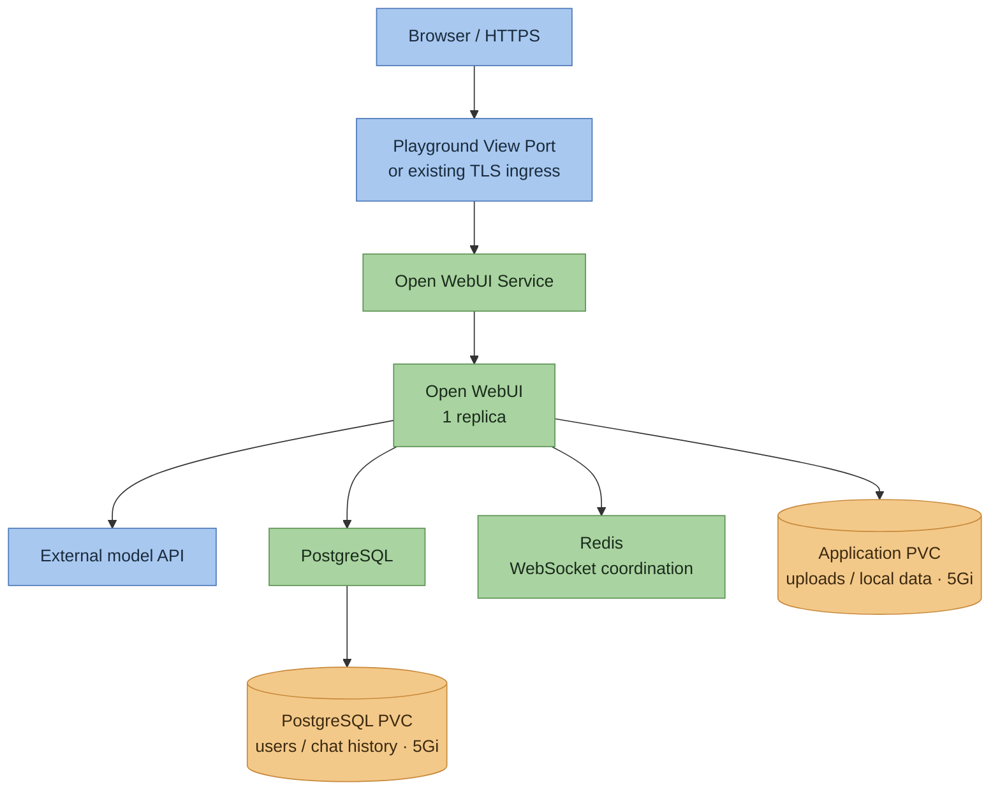

# Open WebUI — Kubernetes Deployment

> A ThinkWithOps DevOps project deploying Open WebUI with PostgreSQL, Redis, and persistent storage on the Kubernetes multi-node playground.


---

## Table of Contents

- [Project Description](#project-description)
- [Video Series](#video-series)
- [Attribution](#attribution)
- [V1 — Kubernetes Deployment](#v1--kubernetes-deployment)
- [Architecture](#architecture)
- [Tech Stack](#tech-stack)
- [Prerequisites](#prerequisites)
- [How to Deploy](#how-to-deploy)
- [Browser Access](#browser-access)
- [Project Structure](#project-structure)
- [Verification](#verification)
- [Backup and Recovery](#backup-and-recovery)
- [Limitations](#limitations)

---

## Project Description

This repository adds a Kubernetes deployment layer to [Open WebUI](https://github.com/open-webui/open-webui), a web interface for interacting with language models.

The project runs on an existing **Kubernetes multi-node** playground. A pinned official Helm chart deploys Open WebUI; PostgreSQL stores users and chat history, Redis supports WebSocket communication, and persistent volumes hold database files and uploads.

Application source remains unchanged. Project additions cover Helm configuration, deployment scripts, CI validation, verification, and recovery.

## Video Series

| Part | Tag | Focus | Status |
|---|---|---|---|
| V1 | `v1.0-openwebui-k8s-deployment` *(proposed)* | Kubernetes deployment, model connection, chat and persistence verification | Implementation complete; live verification pending |

## Attribution

Open WebUI application source and branding belong to [**open-webui/open-webui**](https://github.com/open-webui/open-webui). See [LICENSE](LICENSE), [LICENSE_NOTICE](LICENSE_NOTICE), and [LICENSE_HISTORY](LICENSE_HISTORY).

The application deployment uses the [official Open WebUI Helm chart](https://github.com/open-webui/helm-charts). ThinkWithOps adds the deployment and operations layer described here.

---

## V1 — Kubernetes Deployment

V1 includes:

- One Open WebUI replica using the published upstream image.
- PostgreSQL with persistent storage for application records.
- Authenticated Redis for WebSocket coordination and transient state.
- A separate persistent volume for uploads and application files.
- An external OpenAI-compatible model endpoint, configured through Kubernetes Secrets.
- Browser access through Playground View Port or an existing TLS ingress.
- Preflight, deployment, chat verification, evidence export, and encrypted backup/restore scripts.
- GitHub Actions for Helm linting, rendering, and configuration checks.

**Current status:** static checks pass. Deployment, real model chat, browser access, and persistence still require verification in the playground.

## Architecture



### How this flows

**Deployment:** GitHub Actions validates the configuration. Deployment runs manually from the playground terminal using Helm.

**Chat:** browser requests reach Open WebUI through its Service. Open WebUI authenticates the user and calls the configured model endpoint.

**State:** PostgreSQL stores application records; the application PVC stores uploaded files and local data. Redis coordinates WebSocket state. One replica and the `Recreate` deployment strategy avoid simultaneous application writers on the RWO volume.

## Tech Stack

| Technology | Version | Role |
|---|---|---|
| Open WebUI | v0.11.3 | Chat interface; published upstream image |
| Official Open WebUI chart | 16.5.0 | Application Deployment, Service, and PVC |
| Project wrapper chart | 1.0.0 | Playground configuration, PostgreSQL, and Redis |
| PostgreSQL | 17.11-bookworm | Persistent application database |
| Redis | 7.4.11-alpine3.21 | Authenticated WebSocket state |
| Helm | 3.19.0 in CI | Dependency management and deployment |
| Bash / Python | Python 3.10+, PyYAML 6.0.2 | Deployment and verification scripts |
| GitHub Actions | Validation workflow | Lint, render, configuration guards |

## Prerequisites

- An existing Kubernetes multi-node playground with `kubectl` access.
- Helm, Bash, Git, curl, Python 3.10+, and Python venv support.
- A working StorageClass or the [local-PV setup](docs/storage.md).
- Two 5Gi volumes and at least **850m CPU / 1344Mi memory** available for workload requests, plus Kubernetes system capacity.
- An approved OpenAI-compatible HTTPS endpoint, API key, and chat model ID.
- The active session's expiry time and HTTPS browser access URL.

## How to Deploy

Run these steps in the **playground terminal**. Use a checkout or transferred copy containing the V1 files; unpublished local changes are not available through `git clone`.

```bash
git clone https://github.com/ThinkWithOps/thinkwithops-openwebui-production.git
cd thinkwithops-openwebui-production

mkdir -p _local
python3 -m venv _local/venv
source _local/venv/bin/activate
python3 -m pip install -r scripts/requirements-validation.txt

kubectl config current-context
kubectl get storageclass

# Replace with the inspected session details.
export EXPECTED_CONTEXT='REPLACE_WITH_PLAYGROUND_CONTEXT'
export SESSION_EXPIRES_AT='REPLACE_WITH_ACTUAL_EXPIRY_AND_TIMEZONE'
export PLAYGROUND_ACCESS_METHOD='Playground View Port on 30080'
export STORAGE_CLASS='REPLACE_WITH_VERIFIED_CLASS'

bash scripts/preflight.sh
```

Review preflight results and resolve blocked checks. Obtain the HTTPS View Port URL, then configure the application:

```bash
python3 scripts/configure-playground.py
export PREFLIGHT_REVIEWED=yes
bash scripts/deploy.sh
```

The configuration script prompts for the endpoint, model, storage, browser URL, admin credentials, and API key. Credentials stay in Kubernetes Secrets and ignored private files. Keep `WEBUI_SECRET_KEY` stable across restarts and restores.

See the [deployment guide](docs/deployment.md) for Helm installation, credential handling, and ingress configuration.

## Browser Access

Default access: **Playground View Port → 30080**. Set `WEBUI_URL` to the exact HTTPS URL generated by the active session.

If View Port runs on a separate entry node, use the [forwarding instructions](docs/deployment.md). An existing ingress controller can instead use the [TLS ingress profile](docs/deployment.md#existing-ingress--tls).

## Project Structure

```text
helm-chart/                     Pinned Helm wrapper and playground profiles
scripts/preflight.sh            Environment and permission checks
scripts/configure-playground.py Private credentials and session configuration
scripts/deploy.sh               Repeatable Helm deployment
scripts/verify.sh               Health, chat, and pod-restart persistence checks
scripts/export-artifacts.sh     Sanitized configuration and state export
scripts/backup.sh               Encrypted backup
scripts/restore.sh              Fresh-session restore
.github/workflows/deploy.yml    CI validation
docs/deployment.md              Detailed setup and browser access
docs/storage.md                 Storage setup
docs/verification.md            Browser and acceptance checklist
docs/recovery.md                Backup and recovery runbook
docs/evidence/v1/               Verification results
_local/                        Ignored credentials and session files
```

## Verification

```bash
bash scripts/verify.sh
bash scripts/export-artifacts.sh
```

The scripts check database/Redis connectivity, sign-in, a real model response, saved chat history, and persistence after restarting only Open WebUI. Complete the [browser checklist](docs/verification.md) for HTTPS, streaming, WebSockets, and uploaded files.

| Check | Status |
|---|---|
| Helm lint/render, both access profiles | Passed |
| Configuration guards, syntax, 8 guard tests | Passed |
| Playground deployment and backend readiness | Pending |
| Real model chat and browser access | Pending |
| App-only restart persistence | Pending |
| Fresh-session restore | Pending |
| Automated deployment from GitHub Actions | Not enabled; connectivity and credentials unverified |

See [V1 evidence](docs/evidence/v1/README.md) and [actual static output](docs/evidence/v1/static-validation.txt).

## Backup and Recovery

Use the [recovery runbook](docs/recovery.md) to create an encrypted backup and restore into a fresh session.

**Pod-restart persistence and session-expiry survival are different.** Download backups outside the playground before expiry. Git contains configuration; it does not contain users, chats, uploads, or credentials.

## Limitations

- Single application, PostgreSQL, and Redis instances; this deployment is not highly available.
- Local-PV storage depends on the selected worker and does not survive playground expiry.
- Model provider access and runtime capacity remain unverified. API usage may incur charges.
- View Port uses the platform's HTTPS proxy; backend NodePort traffic is HTTP. Browser TLS/WebSocket behavior requires live verification.
- Database/Redis connections are authenticated but unencrypted within the lab network.
- Image versions use exact tags rather than immutable digests.
- CI validates configuration; deployment runs manually inside the playground.
